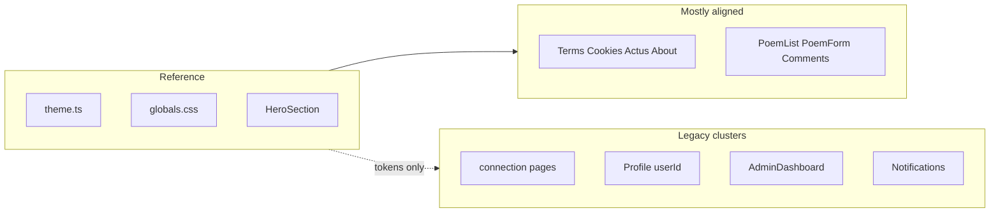

# Audit design vitrine, migration, restructuration docs/

## Référence « nouveau design »

- **Tokens et conventions** : [`src/styles/theme.ts`](src/styles/theme.ts) (`typography`, `components.card|button|input|nav`, `commonClasses`, `fonts.serif` Playfair / `font-sans` Inter).
- **Global** : [`src/styles/globals.css`](src/styles/globals.css) (`:root` / `html.dark`, utilitaires `btn-primary`, `card`, barre mobile, spinners vitrine).
- **Composants de référence** : [`src/components/Home.tsx`](src/components/Home.tsx), [`src/components/Home/HeroSection.tsx`](src/components/Home/HeroSection.tsx) (imports `fonts`, `components`).

**Heuristique d’audit** : présence de `gray-*` (vs `zinc`/`stone`), CTAs ou filets `blue-*` / `from-blue`, accents `indigo` / `purple` / `violet`, ou spinners bleu/indigo — considéré comme **legacy** par rapport au vitrine.

---

## Tâche 1 — Résultat d’audit (statuts)

| Zone | Statut | Commentaire court |
|------|--------|-------------------|
| [`src/components/Home.tsx`](src/components/Home.tsx), [`HeroSection.tsx`](src/components/Home/HeroSection.tsx), [`layouts/EventBanner.tsx`](src/layouts/EventBanner.tsx) | **Partiel** | Vitrine zinc/stone ; spinner [`EventBanner.tsx`](src/layouts/EventBanner.tsx) encore `border-t-blue-*`. |
| [`src/components/About.tsx`](src/components/About.tsx), [`src/components/Terms.tsx`](src/components/Terms.tsx), [`src/pages/cookies.tsx`](src/pages/cookies.tsx), [`src/components/Actus/ActusPage.tsx`](src/components/Actus/ActusPage.tsx) | **Migré** | `components.card` / zinc / `fonts.serif` ; pas de motifs legacy listés. |
| [`src/components/Poems/PoemList.tsx`](src/components/Poems/PoemList.tsx), [`PoemForm.tsx`](src/components/Poems/PoemForm.tsx), [`Comments.tsx`](src/components/Poems/Comments.tsx) | **Migré** | Pas de `gray`/`blue`/`indigo` legacy dans ces fichiers. |
| [`src/components/Poems/PoemDetails.tsx`](src/components/Poems/PoemDetails.tsx) | **Partiel** | Une variante encore en `blue-*` (l. ~284, état surligné). |
| [`src/components/Poems/PoemCard.tsx`](src/components/Poems/PoemCard.tsx) | **Partiel** | Badges `indigo` / `violet` / `blue-*` ; carte peut déjà suivre le vitrine ailleurs. |
| [`src/components/Poems/PoemCardCompact.tsx`](src/components/Poems/PoemCardCompact.tsx) | **Non migré** | `gray-*`, titres `blue-*`, `hover:border-blue-*`. |
| [`src/pages/connection/*.tsx`](src/pages/connection/) (index, register, password_reset, reset-password) | **Non migré** | Cartes `gray-*`, filets `from-blue`, bouton Google `blue-800`, liens `blue-*`. |
| [`src/components/Auth/RequireAuthMessage.tsx`](src/components/Auth/RequireAuthMessage.tsx) | **Partiel** | Carte `gray` + accent `blue` sur le filet décoratif. |
| [`src/components/Profile.tsx`](src/components/Profile.tsx), [`src/pages/user/[id].tsx`](src/pages/user/[id].tsx), [`Profile/PseudoBioForm.tsx`](src/components/Profile/PseudoBioForm.tsx) | **Non migré** | Très dense en `gray-*`, CTAs `blue-*`, icônes `indigo`/`purple`. |
| [`src/components/AdminDashboard.tsx`](src/components/AdminDashboard.tsx) | **Non migré** | `gray-*`, cartes accent `purple`/`indigo`/`blue`, boutons `indigo`/`purple`/`blue`. |
| [`src/components/Event/EventDetails.tsx`](src/components/Event/EventDetails.tsx) | **Partiel** | Bloc événement très « jaune/orange » + boutons `indigo-*` (à ramener à zinc/CTA vitrine ou amber sobre). |
| [`src/components/Poems/PoemSuccessView.tsx`](src/components/Poems/PoemSuccessView.tsx) | **Non migré** | CTA `from-blue-600 to-blue-700`. |
| Notifications : [`Notification.tsx`](src/components/Notifications/Notification.tsx), [`NotificationCard.tsx`](src/components/Notifications/NotificationCard.tsx), [`NotificationDropdown.tsx`](src/components/Notifications/NotificationDropdown.tsx), [`src/pages/mobile/notifications.tsx`](src/pages/mobile/notifications.tsx) | **Non migré** | `gray-*`, `blue-*`, dégradés bleu. |
| [`src/components/CookieConsent.tsx`](src/components/CookieConsent.tsx) | **Non migré** | Icône + CTA `blue` dégradé. |
| Soutien : [`SupportSiteButton.tsx`](src/components/Support/SupportSiteButton.tsx), [`SupportSiteModal.tsx`](src/components/Support/SupportSiteModal.tsx), [`SupportModal.tsx`](src/components/Support/SupportModal.tsx), [`BaseSupportModal.tsx`](src/components/Support/BaseSupportModal.tsx), [`TipsSetupBanner.tsx`](src/components/Support/TipsSetupBanner.tsx) | **Partiel** | Incohérence desktop `blue-700` vs mobile amber/orange ; modales/bannières rose/rouge — **à unifier vitrine (zinc + amber/orange)** selon ton choix. |
| [`src/layouts/LoadingLittleSpinner.tsx`](src/layouts/LoadingLittleSpinner.tsx), [`src/components/Common/Typewriter.tsx`](src/components/Common/Typewriter.tsx) | **Partiel** | Spinner bleu/indigo ; curseur typewriter `blue-*` (détail mais visible). |
| [`src/pages/unsubscribe.tsx`](src/pages/unsubscribe.tsx), [`src/pages/tip/success.tsx`](src/pages/tip/success.tsx), [`src/pages/poems/write-poems.tsx`](src/pages/poems/write-poems.tsx) | **Partiel** | CTAs `blue` / fonds `gray` / une ligne `text-gray` (write-poems). |
| Layouts migrés récemment ([`WebNavBar.tsx`](src/layouts/WebNavBar.tsx), [`MobileAppNavBar.tsx`](src/layouts/MobileAppNavBar.tsx), [`Footer.tsx`](src/layouts/Footer.tsx)) | **Migré** (sous réserve recette) | Alignés vitrine dans la branche actuelle. |

Les pages « shell » minces ([`index.tsx`](src/pages/index.tsx), [`terms.tsx`](src/pages/terms.tsx), [`admin.tsx`](src/pages/admin.tsx), etc.) héritent du statut des composants qu’elles montent.

---

## Tâche 2 — Migration (après validation de la liste)

**Principe** : uniquement **classes Tailwind / composants thème** ; pas de changement de logique, hooks, ou API.

1. **Remplacements systématiques** (par fichier du tableau) :
   - `gray-*` → équivalents `zinc-*` (surfaces/bordures/textes comme dans [`theme.ts`](src/styles/theme.ts)).
   - CTAs primaires → `components.button.cta` ou `btn-primary` / variantes déjà définies dans [`theme.ts`](src/styles/theme.ts) et [`globals.css`](src/styles/globals.css).
   - Accents `indigo` / `purple` / `violet` → pills `components.pill.tag` ou zinc + accent sobre (`rose`/`amber` si besoin d’état, comme dans le thème poésie).
   - **Soutien / tip** : remplacer dégradés rose/rouge et le desktop `blue-700` par la même logique **amber/orange + zinc** que le chemin mobile de [`SupportSiteButton.tsx`](src/components/Support/SupportSiteButton.tsx), de façon cohérente sur [`SupportModal.tsx`](src/components/Support/SupportModal.tsx), [`BaseSupportModal.tsx`](src/components/Support/BaseSupportModal.tsx), [`TipsSetupBanner.tsx`](src/components/Support/TipsSetupBanner.tsx).

2. **Spinners / loaders** : aligner sur [`globals.css`](src/styles/globals.css) `.loading-spinner` ou palette zinc (éviter blue/indigo sauf charte exceptionnelle).

3. **Fichiers « gros »** : [`AdminDashboard.tsx`](src/components/AdminDashboard.tsx) et [`Profile.tsx`](src/components/Profile.tsx) — traiter par sections visuelles (cartes, tableaux, boutons) sans refactor JSX profond.

4. **Vérification** : `yarn test` / tests concernés + smoke manuel des parcours connection, profil, admin, notification, tip.

---

## Tâche 3 — `docs/` (racine : seulement [`README.md`](README.md))

**Créer** :

| Fichier | Contenu |
|---------|---------|
| [`docs/audit.md`](docs/audit.md) | Reprendre le tableau + détails (fichiers, motifs repérés, liens vers grep / lignes si utile) ; historiser la date d’audit. |
| [`docs/documentation.md`](docs/documentation.md) | **Migration structurée** de [`DOCUMENTATION.md`](DOCUMENTATION.md) : stack Next.js, structure `src/`, auth/email/cookies, tests, déploiement — **complété** par une section Architecture (layouts, providers, API routes clés) et conventions (alias `@/`, thème). |
| [`docs/finance.md`](docs/finance.md) | Reprendre le contenu actuel de [`FINANCE.md`](FINANCE.md) (plan blockchain / options) ; ajouter une courte section « périmètre produit » si tu veux y noter budget infra ou monétisation plus tard. |
| [`docs/vitrine-theme.md`](docs/vitrine-theme.md) | Fusionner [`VITRINE-THEME.md`](VITRINE-THEME.md) + référence explicite à `theme.ts`, `globals.css`, dark mode (`ThemeContext`), et liste des primitives (`card`, `btn-*`, typo serif/sans). |
| [`docs/roadmap.md`](docs/roadmap.md) | Liste des **gaps** issus de l’audit (clusters legacy) ; placeholders pour tes suites ; lien vers `audit.md`. |

**Déplacer / archiver** (plus de `.md` à la racine sauf README) :

- [`CHANGELOG.md`](CHANGELOG.md) → `docs/CHANGELOG.md` (ou sous-section en fin de `documentation.md` si tu préfères un seul fichier historique — par défaut **`docs/CHANGELOG.md`** pour clarté).
- [`AUDIT-CENTRALISATION.md`](AUDIT-CENTRALISATION.md) → `docs/_archive/audit-centralisation.md` (ou fusion des parties encore utiles dans `documentation.md`, puis archive).

**Règle projet** : après mise en œuvre, mettre à jour le journal Local Brain ([`epidemie-des-mots.md`](file:///mnt/c/Users/louis/Documents/Local%20Brain/projects/epidemie-des-mots.md)) — entrée courte date + audit/migration/docs.

---

## Ordre d’exécution recommandé

1. Rédiger `docs/audit.md` (reflète la tâche 1).
2. Valider la liste avec toi (cette conversation ou PR).
3. Migration par cluster (auth → notifications → profile → admin → support → reste).
4. Finaliser les cinq fichiers `docs/` + déplacements + mise à jour des liens internes (README vers `docs/…`).
