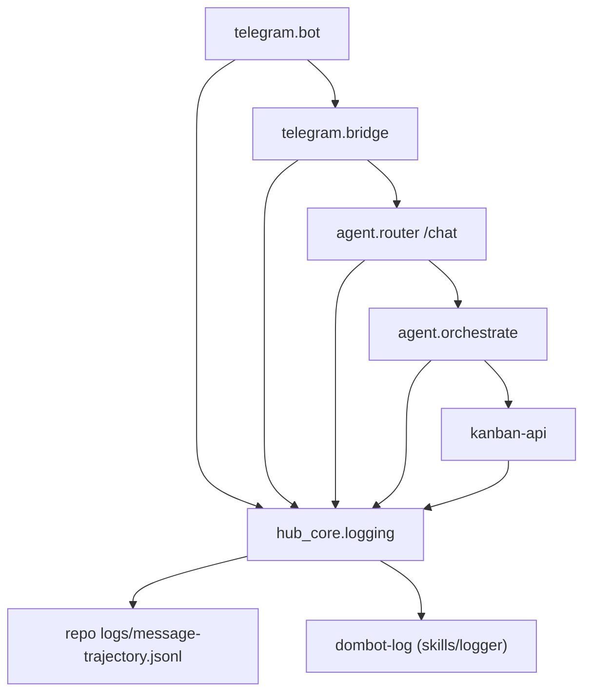

# Centralize Service Logging in hub_core

## Goals

- Move logger construction and write policy to `hub-core` so all services import one logger API.
- Keep dual behavior: structured local trajectory logs + DomBot logger bridge (`dombot-log`).
- Standardize message trajectory events for end-to-end audits (`telegram -> bridge -> agent -> kanban`).
- Default sink: `<repo>/logs/`.
- Remove home-scoped sink defaults (no `Path.home() / ".openclaw" / "logs"` hard-default in shared runtime logger).
- Ensure logs are mount-friendly for Clawvis platform log features (repo-local bind mount).

## Current State (from audit)

- Logging logic is duplicated and inconsistent across:
  - [`services/telegram/core/bot.py`](/home/lgiron/lab/clawvis/services/telegram/core/bot.py)
  - [`services/telegram/core/bridge.py`](/home/lgiron/lab/clawvis/services/telegram/core/bridge.py)
  - [`services/agent/agent_service/router.py`](/home/lgiron/lab/clawvis/services/agent/agent_service/router.py)
- Kanban already uses DomBot subprocess logging in [`services/kanban/kanban_api/core.py`](/home/lgiron/lab/clawvis/services/kanban/kanban_api/core.py).
- `hub_core` already has a DomBot log bridge in [`hub-core/hub_core/dombot_log.py`](/home/lgiron/lab/clawvis/hub-core/hub_core/dombot_log.py), but not a unified service logger API.
- Existing DomBot bridge currently defaults to `LOG_DIR = Path.home() / ".openclaw" / "logs"`; this must be replaced with centralized repo-local runtime sink policy.
- Workspace currently excludes agent/telegram/scheduler in [`pyproject.toml`](/home/lgiron/lab/clawvis/pyproject.toml).

## Target Architecture

## Implementation Plan

1. **Create shared logger module in `hub_core`**
   - Add new module (e.g. [`hub-core/hub_core/central_logger.py`](/home/lgiron/lab/clawvis/hub-core/hub_core/central_logger.py)) with:
     - `get_logger(component: str)` returning configured loguru logger.
     - `trace_event(component, event, **meta)` for consistent structured events.
    - Path resolver with default `<repo>/logs/message-trajectory.jsonl` and env override.
     - DomBot bridge integration via existing [`hub_core.dombot_log.log()`](/home/lgiron/lab/clawvis/hub-core/hub_core/dombot_log.py).
   - Ensure logger init is idempotent (no duplicate sinks).

2. **Remove home-based default from DomBot logger bridge**
   - Update [`hub-core/hub_core/dombot_log.py`](/home/lgiron/lab/clawvis/hub-core/hub_core/dombot_log.py):
     - remove hard default `LOG_DIR = Path.home() / ".openclaw" / "logs"` as primary sink.
     - use centralized resolver (repo-local `logs/`) for runtime service logs.
   - Keep compatibility path only as explicit override (if needed), not default.

3. **Define canonical event schema for trajectory audits**
   - Standard fields: `ts`, `trace_id`, `component`, `event`, `user_id?`, `chat_id?`, `message_chars?`, `status?`, `error?`.
   - Add helper to generate/propagate `trace_id` across hops.

4. **Refactor Telegram bot + bridge to use hub_core logger**
   - Replace ad-hoc loguru + subprocess logic in:
     - [`services/telegram/core/bot.py`](/home/lgiron/lab/clawvis/services/telegram/core/bot.py)
     - [`services/telegram/core/bridge.py`](/home/lgiron/lab/clawvis/services/telegram/core/bridge.py)
   - Use `trace_id` injection in bridge payload metadata where possible.

5. **Refactor agent router (and orchestrate path) to shared logger**
   - Replace local logger setup in [`services/agent/agent_service/router.py`](/home/lgiron/lab/clawvis/services/agent/agent_service/router.py).
   - Keep `agent.orchestrate` events aligned with canonical schema and include `trace_id` when available.

6. **Refactor kanban logging entry points to shared logger API**
   - In [`services/kanban/kanban_api/core.py`](/home/lgiron/lab/clawvis/services/kanban/kanban_api/core.py), replace direct `subprocess.Popen(dombot-log ...)` helper with `hub_core` logger wrapper.
   - Preserve existing action names (`task:create`, etc.) for backward compatibility.

7. **Extend UV workspace and service dependencies**
   - Update [`pyproject.toml`](/home/lgiron/lab/clawvis/pyproject.toml) workspace members to include:
     - `services/agent`
     - `services/telegram`
     - `services/scheduler`
   - Add `dombot-hub-core` dependency/source in each service `pyproject.toml` where logger is imported.

8. **Container/runtime wiring for central sink**
   - Ensure `docker-compose` mounts `./logs` for relevant services and sets optional envs (`CENTRAL_LOG_FILE`, `LOGGER_CORE`) consistently.
   - Keep default behavior to repo `logs/` without requiring env configuration.

9. **Tests + regression checks**
   - Update existing service tests that assert logging behavior.
   - Add focused tests for:
     - logger init idempotency
     - event schema validity
     - DomBot bridge call path (mocked)
     - trajectory continuity (`trace_id` propagation)

10. **Operational audit runbook update**
   - Add concise docs section on how to inspect trajectory:
     - `logs/message-trajectory.jsonl`
     - `docker compose logs ...` cross-check
     - expected event sequence by component.

## Risks / Mitigations

- **Workspace expansion conflicts**: isolate by updating service lockfiles and running per-service `uv sync` validation.
- **Duplicate log lines**: enforce single sink registration in shared logger.
- **High-volume event noise**: define minimal required events + optional verbose mode.
- **Path divergence between local/dev/container**: enforce a single resolver and cover with integration tests.

## Acceptance Criteria

- Telegram, bridge, agent, orchestrate, and kanban all import logger from `hub_core`.
- No ad-hoc per-service `loguru.add(...)` or direct `dombot-log` subprocess calls remain in those paths.
- New message creates a contiguous trajectory in `<repo>/logs/message-trajectory.jsonl` with shared `trace_id`.
- No default writes to `~/.openclaw/logs` for centralized service trajectory logs.
- `logs/` is bind-mounted/readable by Clawvis platform log features.
- Existing tests pass; added logger tests pass.