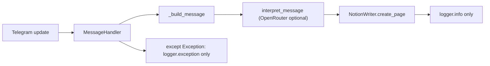

# DomNotionBot: no Telegram reply and no Notion rows

## What the code actually does

- **No in-chat reply is by design today.** [`telegram_to_notion/bot.py`](telegram_to_notion/bot.py) handler (lines 110–119) never calls `effective_message.reply_text` (or similar). Success only logs `wrote notion page …`; failures are swallowed into `logger.exception` with **no user-visible signal**.
- So your symptoms split into two questions: (1) **Is the handler running?** (2) **If yes, does `pages.create` succeed or throw?** Both are answered from **server logs**, not from Telegram UI.

## Likely root causes (ordered by probability)

| Area | Why nothing in Notion / feels “dead” |
|------|--------------------------------------|
| **Notion `pages.create` 400** | Property **names or types** on the DB do not match what [`notion.py`](telegram_to_notion/notion.py) sends: `Title`, `Label`, `Type`, `Description`, `Interest` (rich_text), `Sender`, `Date`, `Media type` (select), optional `URL` (url). Wrong type (e.g. `Type` as **select** in Notion while we send **rich_text**) or missing **`Media type`** option (e.g. `text`) causes API errors. |
| **Integration / DB id** | Wrong `NOTION_DATABASE_ID`, or database **not shared** with the integration. |
| **Process / env on devbox** | Service crashed after restart, wrong `.env` path, or bot token not the **DomNotionBot** token. |
| **Update not matched** | Only [`filters.TEXT \| PHOTO \| Document \| VIDEO \| ANIMATION \| VOICE`](telegram_to_notion/bot.py) are wired. Stickers, locations, **channel posts** (if you expect those), or other types are ignored **silently** (no handler). |
| **OpenRouter latency** | [`openrouter.py`](telegram_to_notion/openrouter.py) uses **90s** HTTP timeout; a slow/hung call delays Notion creation with **no Telegram feedback** (still no bug in “no reply”, but feels broken). |
| **Voice + CPU** | Voice path runs Whisper on CPU; can be slow or OOM on small VPS; errors still only in logs. |

**Note:** `filters.TEXT` **does** match messages that look like commands (PTB doc: commands are accepted); a plain `/start` still runs the handler **if** `message.text` is set. So “command-only” is **less** likely than Notion/schema or service issues.

## Phase 1 — Verify (read-only audit on devbox)

Run on **devbox** (replace nothing; read logs only):

1. **Service alive**  
   `systemctl --user is-active telegram-to-notion.service`  
   `systemctl --user status telegram-to-notion.service --no-pager -l`

2. **Recent errors**  
   `journalctl --user -u telegram-to-notion.service -n 200 --no-pager`  
   Search for: `failed to forward`, `APIResponseError`, `ValidationError`, `HTTPStatusError`, `OpenRouter`, `Transcription`, tracebacks.

3. **Confirm code revision**  
   `cd ~/Lab/dom-telegram-to-notion && git log -1 --oneline`  
   Matches what you expect from GitHub `main`.

4. **Optional: one-shot Notion schema check** (if you have `NOTION_TOKEN` in shell or small script): `databases.retrieve` on `NOTION_DATABASE_ID` and compare property **names and `type`** to the table in [`README.md`](README.md).

**Interpretation:** If logs show `failed to forward telegram message to notion` with Notion body text like *“X is not a property that exists”* or *type mismatch*, fix the **Notion database schema** first (fastest fix). If logs show nothing when you send a message, the update is **not reaching** the handler (token, wrong bot, or Telegram client not talking to this bot).

## Phase 2 — Fix (implementation plan after audit confirms)

1. **User-visible Telegram feedback (recommended)**  
   In [`bot.py`](telegram_to_notion/bot.py) `handle`, after successful `create_page`: `reply_text` with a short summary (title + Notion page id or link pattern). In `except`: `reply_text` with a **sanitized** error (“Notion rejected the row; check server logs”) — **never** echo `NOTION_TOKEN` / full API body.  
   Optionally add a tiny **`/health`** or **`/ping`** `CommandHandler` so you can verify the bot is the right instance without opening Notion.

2. **Structured logging for failures**  
   On `APIResponseError`, log `exc.code` and message (already partially there via exception). Optionally add one `logger.info` line when a message is **received** (sender + chat id) so you can correlate Telegram vs logs.

3. **Notion schema alignment**  
   Align the DB to the README list and types, **or** make property names/types configurable via env (larger change; only if you want multiple DB layouts).

4. **OpenRouter guardrails (if logs show timeouts/slowness)**  
   Lower timeout, or run enrichment in `asyncio.wait_for` with fallback to `NotionEnrichment.from_incoming` on timeout; optionally skip OpenRouter for empty `body` to save latency.

5. **Deploy loop**  
   After code changes: `git pull` on devbox, `uv sync`, `systemctl --user restart telegram-to-notion.service`, re-test and read logs once.

## What you should do first (before code changes)

1. Run **Phase 1** `journalctl` on **devbox** right after reproducing one message from DomNotionBot.  
2. Paste (redact secrets) the **single traceback or Notion error line** if present — that determines whether the fix is **schema**, **token/db**, **OpenRouter**, or **handler coverage**.

No repo edits are required until those logs identify which bucket applies.
