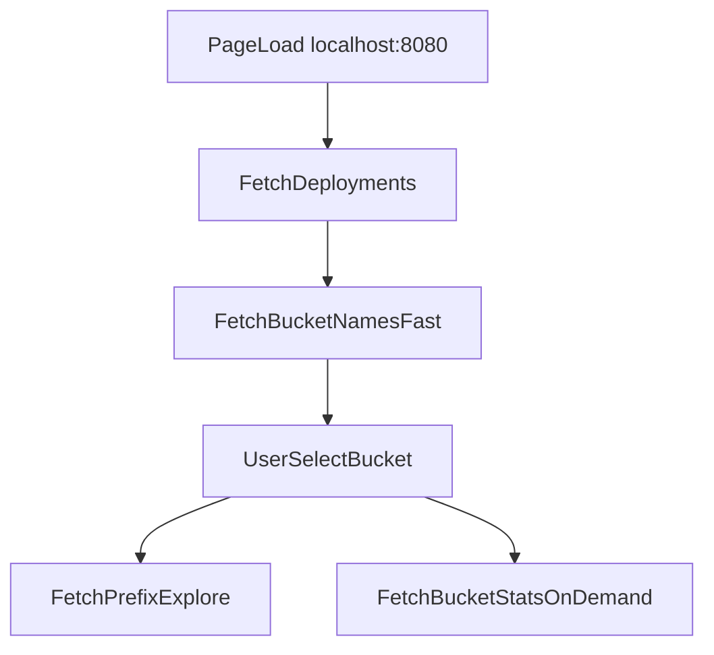

# Fix Backend Timeout And UI Redesign

## Current Findings
- Runtime is reachable on localhost:
  - `GET /health` returns `200`.
  - `GET /api/deployments` returns deployments including `aws-coe`.
- Blocking issue is specifically bucket loading:
  - `GET /api/deployments/aws-coe/buckets` times out (>120s from host).
- Root cause in backend implementation: bucket list endpoint computes full per-bucket aggregates by iterating all objects before returning, which is too expensive for large buckets in [backend/app/routers/buckets.py](/home/lgiron/acsg_coe_lab/s3-explorer/backend/app/routers/buckets.py).
- Design debt is structural:
  - Heavy inline styles across components and generic Vite defaults in [frontend/src/index.css](/home/lgiron/acsg_coe_lab/s3-explorer/frontend/src/index.css), [frontend/src/App.css](/home/lgiron/acsg_coe_lab/s3-explorer/frontend/src/App.css), and components.

## Implementation Strategy

### 1) Make bucket listing fast and deterministic
- Split responsibilities in backend:
  - Keep existing stats endpoint for heavy analytics.
  - Add/adjust a fast bucket listing mode that returns bucket names quickly without full object scans.
- Candidate minimal change:
  - Update `GET /deployments/{deployment}/buckets` to return only lightweight metadata (name, creation date if available) and placeholder stats defaults.
  - Move expensive aggregation strictly to `GET /deployments/{deployment}/buckets/{bucket}/stats`.
- Add explicit boto3 client timeouts/retries in [backend/app/s3_client.py](/home/lgiron/acsg_coe_lab/s3-explorer/backend/app/s3_client.py) (connect/read timeout + adaptive retry) so unreachable providers fail fast instead of hanging.
- Harden error mapping in [backend/app/routers/buckets.py](/home/lgiron/acsg_coe_lab/s3-explorer/backend/app/routers/buckets.py) for timeout/network exceptions to return actionable HTTP errors (e.g., gateway timeout style response).

### 2) Align frontend data flow with lazy stats loading
- Update bucket list view to render immediately from fast bucket response, then fetch per-bucket analytics only when needed:
  - Selection action opens explorer first (prefix access path).
  - FinOps panel loads stats asynchronously after bucket selection.
- Files to update:
  - [frontend/src/api/client.ts](/home/lgiron/acsg_coe_lab/s3-explorer/frontend/src/api/client.ts)
  - [frontend/src/components/BucketList.tsx](/home/lgiron/acsg_coe_lab/s3-explorer/frontend/src/components/BucketList.tsx)
  - [frontend/src/components/FinOpsDashboard.tsx](/home/lgiron/acsg_coe_lab/s3-explorer/frontend/src/components/FinOpsDashboard.tsx)
  - shared types in [frontend/src/types/index.ts](/home/lgiron/acsg_coe_lab/s3-explorer/frontend/src/types/index.ts)

### 3) Drastically improve visual design (first major pass)
- Replace current inline-style-heavy UI with consistent design tokens and reusable card/table/button classes.
- Refactor layout in [frontend/src/App.tsx](/home/lgiron/acsg_coe_lab/s3-explorer/frontend/src/App.tsx) + [frontend/src/App.css](/home/lgiron/acsg_coe_lab/s3-explorer/frontend/src/App.css):
  - Professional header with concise context/status.
  - Two-column desktop layout: left navigation/filter + right explorer content.
  - Clear empty/loading/error states.
- Normalize global styling in [frontend/src/index.css](/home/lgiron/acsg_coe_lab/s3-explorer/frontend/src/index.css): remove conflicting Vite defaults (`place-items: center` patterns) and enforce app-first layout.
- Component polish:
  - Bucket list row hierarchy, hover/selection states, sticky headers.
  - Explorer breadcrumbs, icons, and clearer click targets.
  - Dashboard cards/charts visual consistency.

### 4) Verify first access to `aws-coe` prefix from localhost
- Runtime verification sequence:
  - `make up`
  - `curl /api/deployments`
  - `curl /api/deployments/aws-coe/buckets`
  - `curl /api/deployments/aws-coe/buckets/<first-bucket>/explore?prefix=`
- UI verification:
  - Open `http://localhost:8080`
  - Select `aws-coe`
  - Open first visible bucket
  - Confirm root prefix listing loads (non-timeout).

### 5) Add local `make dev` workflow
- Extend [Makefile](/home/lgiron/acsg_coe_lab/s3-explorer/Makefile) with a `dev` target that runs both services in local development mode:
  - Backend via FastAPI CLI (from `backend/`), e.g. `fastapi dev app/main.py --host 0.0.0.0 --port 8000`.
  - Frontend via Vite dev server (from `frontend/`), e.g. `npm run dev -- --host 0.0.0.0 --port 8080`.
- Ensure this single command keeps both process logs visible and terminates both processes cleanly on Ctrl+C.
- Keep this workflow distinct from Docker orchestration targets (`make up`, `make down`).

### 6) Fix Open OnDemand localhost access
- Diagnose why Open OnDemand is not reachable on localhost despite container startup:
  - Validate container/port exposure (`80`, `443`, `5556`) and health from host.
  - Check startup logs for Apache/Dex/SSL/entrypoint failures in `ondemand`.
  - Verify TLS/certificate/bootstrap paths used by [docker-compose.yml](/home/lgiron/acsg_coe_lab/s3-explorer/docker-compose.yml) and `openondemand` entrypoint/config files.
- Implement minimal fixes required for local reachability:
  - Correct listener/bind issues, startup ordering, or cert path/config mismatches as needed.
  - Preserve existing OOD functional intent while restoring local access.
- Verify with browser + curl:
  - `http://localhost` and `https://localhost` return expected OOD responses.
  - Capture known local TLS warning behavior (if self-signed) and document expected bypass steps.

### 7) Documentation updates
- Update [README.md](/home/lgiron/acsg_coe_lab/s3-explorer/README.md):
  - Clarify lazy stats behavior and timeout expectations.
  - Document `make dev` and when to prefer it vs Docker.
  - Add Open OnDemand localhost access notes (HTTP/HTTPS and cert behavior).
  - Add troubleshooting for provider latency/timeouts.
- Update [CHANGELOG.md](/home/lgiron/acsg_coe_lab/s3-explorer/CHANGELOG.md) with backend performance, frontend UX overhaul, `make dev`, and OOD localhost accessibility fixes.