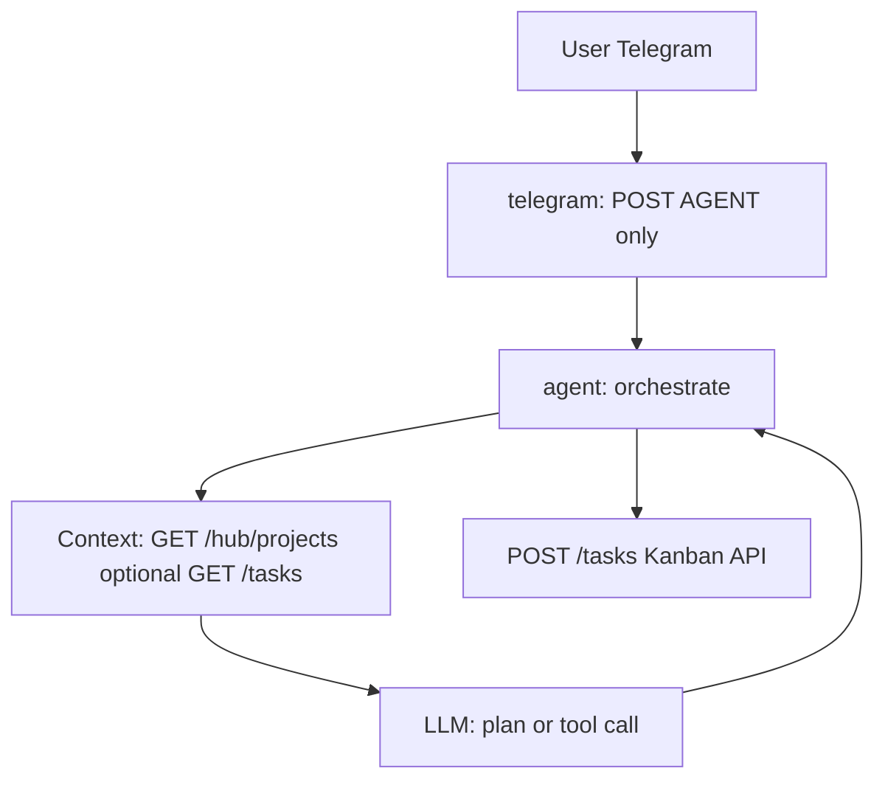

# Fix Telegram Task Creation — agent-orchestrated Kanban

## Constraint (user)

**Telegram must not call Kanban directly.** It should only call the **agent service**. The **agent** orchestrates: gather context, reason about a plan, then perform the Kanban HTTP calls so behavior stays reviewable and extensible (system prompt, tool steps, future RAG, etc.).

## Root cause (unchanged)

- **Agent `/chat` today** is a pure LLM proxy — no `POST` to Kanban. [`services/agent/agent_service/router.py`](services/agent/agent_service/router.py).
- **Snag message** — [`services/telegram/core/formatter.py`](services/telegram/core/formatter.py) maps provider/CLI error prefixes to the generic snag line.
- **Free text** may carry little structure unless the **agent** is instructed to run an orchestration path, not a one-shot answer.

## Target architecture



- **`telegram`**: `AGENT_URL` only; [`services/telegram/core/bridge.py`](services/telegram/core/bridge.py) stays as `POST {agent}/chat` (or future agent routes still on agent).
- **`agent-service`**: `KANBAN_URL` (e.g. `http://kanban-api:8090`); implement orchestration in Python (httpx to Kanban), not in Telegram.

## Implementation directions (agent — pick one main pattern)

1. **Tool / function-calling (preferred for “orchestrate”)**  
   If the active provider supports tools (Anthropic API path): define tools such as `list_projects`, `create_task` mapping to `GET /hub/projects`, `POST /tasks`. The model chooses tools; the **agent** executes them and can stream a human summary. CLI-only path may need a **fallback** (see below).

2. **Server-side two-phase (works with any provider, including CLI)**  
   - Phase A: call LLM with system instructions + optional fetched project list (agent does `GET /hub/projects` first) to produce a **structured plan** (JSON: title, project slug or resolved name, description).  
   - Phase B: agent validates, optionally asks for confirmation in the reply text, then **`POST /tasks`**.  
   - Keeps “context and review” explicit in code and logs.

3. **Enriched prompt only (weakest)**  
   Prepend static instructions to every `/chat` message. Still no guarantee the model calls APIs — **not sufficient alone** for reliable task creation; only as supplement to (1) or (2).

**CLI / `--print` note:** A subprocess LLM may not call HTTP. Orchestration that **does not** depend on the CLI emitting API calls (i.e. agent code performs `httpx` after or between LLM steps) is required when `PRIMARY_AI_PROVIDER=cli`.

## What we are explicitly **not** doing

- **No** `kanban_bridge.py` in `services/telegram` and **no** `KANBAN_URL` in the Telegram container for application traffic.
- **No** `bot.py` shortcut that `POST`s to Kanban before the agent.

## Precise container log audit

Same commands as before; interpret **agent** for orchestration and **kanban** for `POST /tasks` after the agent change.

| Service | What to look for after fix |
|--------|----------------------------|
| `telegram` | Only `POST` to `agent-service`; 409 = duplicate poller |
| `agent-service` | New log lines or access logs for **Kanban HTTP** (e.g. `GET /hub/projects`, `POST /tasks`); **not** just raw `/chat` stream |
| `kanban-api` | `POST /tasks` when the agent orchestration ran |

```bash
docker compose ps
docker compose logs --tail=200 telegram agent-service kanban-api
docker compose logs agent-service 2>&1 | rg -i 'kanban|/tasks|/hub/projects|orchestr'
docker compose logs kanban-api 2>&1 | rg -i 'post|/tasks|task:create'
```

## Logger skill (`dombot-log`) — follow-up (revised)

- **Kanban** — unchanged: [`services/kanban/kanban_api/core.py`](services/kanban/kanban_api/core.py) `_log`; fix **`LOGGER_CORE` / path** in Docker if silent failures matter.
- **Agent** — add structured logging (or optional `dombot-log`) for **orchestration steps**: e.g. `orchestrate:start`, `kanban:get_projects`, `kanban:create_task:ok|fail` — *not* on Telegram, since Telegram no longer touches Kanban.
- Remove references to a “Telegram bridge” dombot process; any new dombot process id should be `agent:orchestrate` (or similar).

## Related: Local Brain session log

[`.cursor/rules/session-implementation-log.mdc`](.cursor/rules/session-implementation-log.mdc) — separate narrative; not a substitute for agent/Kanban logs.
