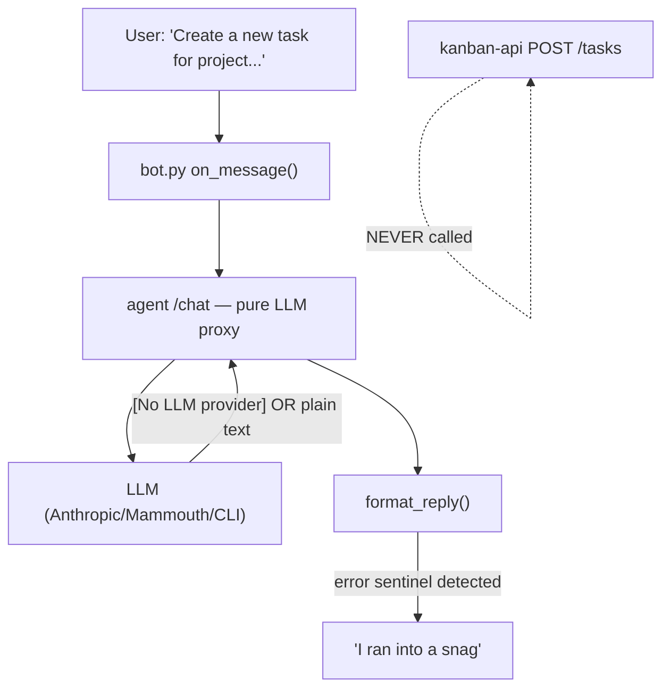
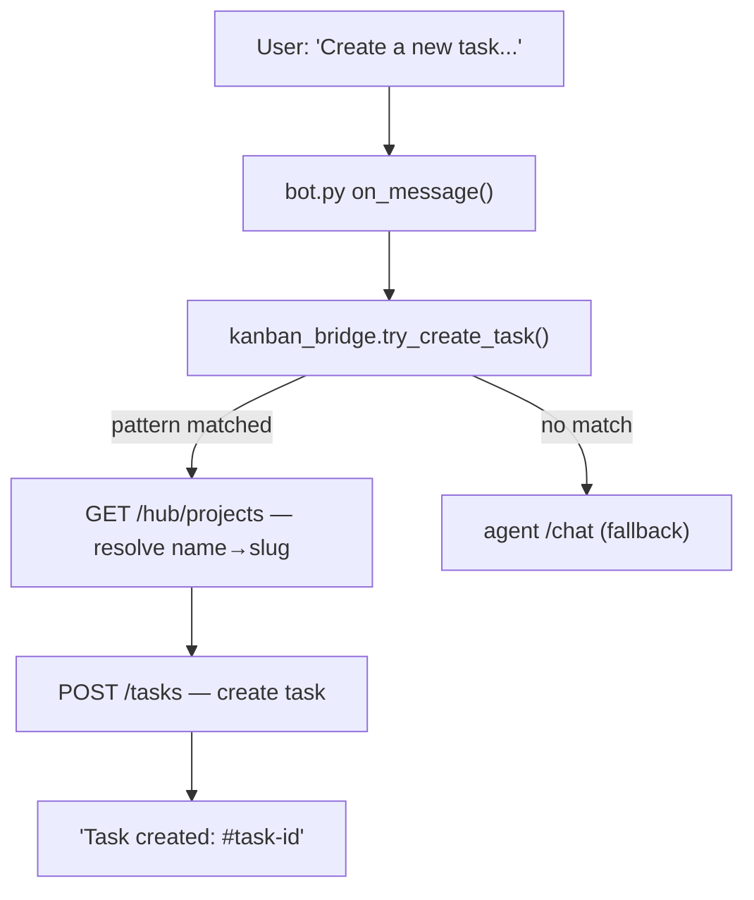

# Fix Telegram Task Creation

## Root Cause Analysis



**Problem 1 — Agent is a dumb proxy:** `/chat` in `router.py` calls the LLM and streams back raw text. It has zero code to call `POST /tasks` on the Kanban API. The LLM generates words, not API calls.

**Problem 2 — Error sentinel → snag message:** `format_reply()` in `formatter.py` converts any response starting with `[No LLM`, `[CLI error:`, `[CLI:`, etc. to the "I ran into a snag" message. The agent is likely returning `[No LLM provider configured...]` because no API key is set and/or CLI is unavailable.

**Problem 3 — Free-text bypasses enricher:** The `enrich()` router in `telegram/core/router.py` only fires for `/tasks`, `/projects`, `/status` Telegram commands. Free-text messages in `on_message` are sent raw to the agent with no enrichment.

**Problem 4 — Telegram has no Kanban URL:** The `telegram` container has `AGENT_URL` but no `KANBAN_URL`. It can't call the Kanban API directly.

## Fix: Deterministic Intent Routing in the Telegram Layer

Instead of relying on the LLM to "know" how to call the Kanban API, add a direct bridge in the Telegram service that pattern-matches known intents and calls the Kanban API itself.



## Files to Change

**1. [`docker-compose.yml`](docker-compose.yml)** — add `KANBAN_URL` to the `telegram` service environment:
```yaml
environment:
  - AGENT_URL=http://agent-service:8092
  - KANBAN_URL=http://kanban-api:8090   # add this
```

**2. [`services/telegram/core/config.py`](services/telegram/core/config.py)** — add `kanban_url` field to `TelegramSettings`:
```python
class TelegramSettings(BaseModel):
    agent_url: str
    kanban_url: str = "http://kanban-api:8090"
    ...
```
Read from `os.environ.get("KANBAN_URL", "http://kanban-api:8090")`.

**3. NEW: [`services/telegram/core/kanban_bridge.py`](services/telegram/core/kanban_bridge.py)** — deterministic intent router:
- Regex patterns for task creation: `create.*task|add.*task|nouveau.*task|ajouter.*tâche|new.*task`
- Project name extraction (text after "project|projet", before ":", or "add|:|-")
- Fuzzy project resolution: `GET /hub/projects` → lowercase/accent-strip match on name
- Task title extraction (text after ":" or after project name)
- `POST /tasks` with `{title, project: slug}`
- Returns formatted confirmation or `None` if no match

**4. [`services/telegram/core/bot.py`](services/telegram/core/bot.py)** — update `on_message` to try bridge first:
```python
from core.kanban_bridge import try_create_task

async def on_message(update, _):
    incoming = incoming_from_update(update)
    if incoming is None:
        return
    settings = get_settings()
    direct = await try_create_task(incoming.text, settings.kanban_url)
    if direct is not None:
        await update.message.reply_text(direct)
        return
    # existing agent fallback...
```

## Intent Patterns to Support

- `"Create a new task for project Epidemie des mots: add a Rendez vous page"`
- `"create a new task in the project epidemie des mots ! ajouter une page rendez vous"`
- `"Ok create a new task in the project epidemie des mots ! ajouter une page rendez vous"`
- `/tasks create Fix login bug` (already handled by `_cmd_routed` but should also use bridge)

## Project Name Resolution

The `POST /tasks` body requires `project` as a **slug** (e.g., `epidemie-des-mots`), not a display name. Bridge calls `GET /hub/projects`, then matches by:
1. Exact slug match
2. Lowercase display name match
3. Normalized match (remove accents, punctuation, extra spaces)

`TaskCreate` required field is only `title`; `project` defaults to `""`.
